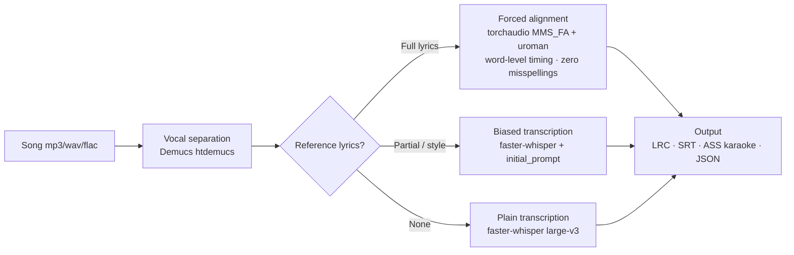
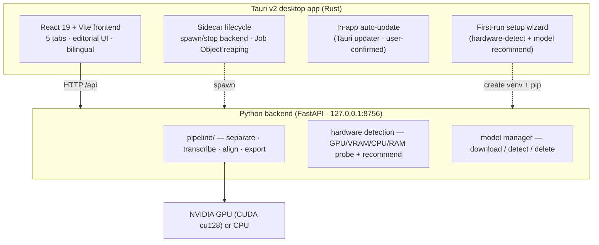
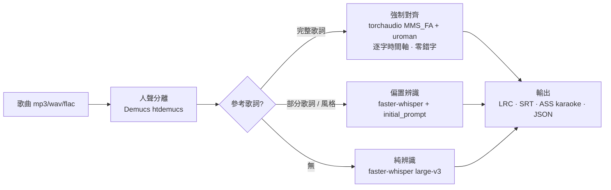
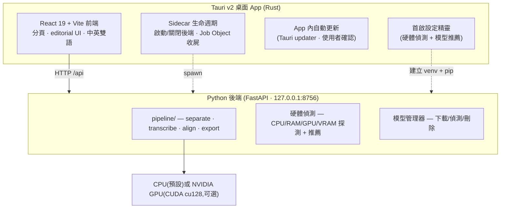

<div align="center">

# ◆ Local Studio

**The complete local studio for artists & content creators**
**給藝人與自媒體製作人的完整本地工作室**

One free, private, offline app for the work that ships your music and videos: **pro mastering** (AI + manual, rivaling LANDR / iZotope Ozone), **word-level lyrics** (LRC / ASS-karaoke), **video subtitles** (SRT / WebVTT), and **on-screen text removal**. Your audio, video and text **never leave your machine** — no upload, no account, no tracking, no minute caps. **Runs on any laptop — no discrete GPU required.**

[](LICENSE)
%20·%20macOS%2FLinux%20(source)-121013)


[](https://github.com/AriesHongHuanWu/local-studio/actions/workflows/ci.yml)

**English** · [中文版 ↓](#-中文版)

<!-- demo GIF: docs/assets/demo.gif -->
<!-- HERO GIF (launch gate): drop the ~7s "reading playhead, gold word-sweep" clip at
     docs/assets/demo.gif and uncomment the line below before the public launch.
      -->

**▶ Demo** — _hero GIF coming soon_ (a 7-second clip of the caption document playing itself, the active word sweeping gold). Until then, [grab a build](https://github.com/AriesHongHuanWu/local-studio/releases) and try a video or song of your own.

</div>

---

## 🇬🇧 What is Local Studio?

Local Studio ([repo: **local-studio**](https://github.com/AriesHongHuanWu/local-studio)) is a free, open-source (MIT) **local-first desktop studio** for musicians, singers, and video / podcast / self-media creators. Four tools, one app, organised into categories you can pin and grow:

- 🎚️ **Mastering** — make a mix release-ready. Intelligent auto-mastering that *listens* to the song and draws its own corrective EQ, plus a deep Pro chain: parametric EQ (per-band phase + Mid/Side), manual multiband, dynamic EQ, adaptive EQ, **draw-it-yourself EQ automation**, **AI stem rebalance** (Demucs separates drums/bass/vocals/other so you can fix a buried vocal — like Ozone's Master Rebalance), loudness-matched A/B and a three-way comparison. Aiming to **surpass LANDR and iZotope Ozone** — fully local and free.
- 🎵 **Song → Lyrics** — turn a song into **word-level timed lyrics** — LRC (line/word), SRT, **ASS karaoke** (`\k` sweep), or JSON — with a music-tuned pipeline (vocal separation + forced alignment), and burn animated captions into a video.
- 🎬 **Video → Subtitles** — transcribe any video or audio into clean, ready-to-use **subtitles** (SRT / WebVTT) in the original language. Just drop a file.
- 🧹 **Text Removal** — box a burned-in caption / watermark-style text region and AI-inpaint it out of every frame, re-encoding with the original audio.

Everything runs **on your own machine**: your audio, video and text never leave the device, there's no cloud upload, no account, and no minute caps.

### 💻 Runs on any laptop — no discrete GPU required

Ai Caption is built to be fast and usable on **CPU-only / iGPU laptops** (e.g. an Intel Core Ultra 9, an AMD Ryzen thin-and-light, an Apple Silicon Mac). It auto-picks CPU-appropriate, fast models with int8 quantization so the **Video → Subtitles** mode stays snappy without a dedicated graphics card. An NVIDIA GPU is **optional** — it just makes things faster, especially the heavier lyrics pipeline.

### Why Ai Caption

- 🎬 **Two modes, one app** — fast **video → subtitles** for any speech or video, plus music-grade **song → word-level lyrics**. Pick the mode that fits the file.
- 💻 **No discrete GPU needed** — defaults auto-pick fast, CPU-appropriate (int8) models so a Core Ultra / Ryzen laptop transcribes captions quickly. A GPU is optional and only adds speed.
- 🎧 **Local-first & private** — faster-whisper (and, for lyrics, Demucs + torchaudio) run entirely on your machine. Nothing is uploaded; nothing is tracked.
- 🎯 **Reference-lyrics = near-perfect (lyrics mode)** — paste the **full** lyrics → **forced alignment** only measures *when* each known word is sung (no guessing, zero misspellings). Paste **partial** lyrics or a style hint → **biased transcription**. Paste nothing → plain transcription.
- 🧭 **Smart first-run wizard** — on first launch the setup wizard **detects your hardware** (CPU, RAM, and any GPU/VRAM/CUDA) and **recommends the right model + device** for your machine, then downloads it for you. Re-run detection any time from Settings.
- 🔄 **In-app auto-update** — the desktop app checks for new releases on startup and updates itself in place (with your confirmation — it never installs silently).
- 🗂️ **Built-in model manager** — download, detect, and delete Whisper models from inside the app; pick a heavier or lighter engine whenever you like.
- 🪄 **Editorial UI** — the caption/lyric document "plays itself": the active word sweeps gold, low-confidence words glow amber, and you can drag any word to retime it.
- 🌏 **Chinese / English / Japanese / Korean / multilingual** — CJK word-level alignment via uroman romanization. UI ships **bilingual (English / 中文)** with a one-click toggle.
- 📤 **Export** subtitles (SRT · **WebVTT**) and lyrics (LRC line/word · SRT · **ASS karaoke** `\k` sweep · JSON).

> v1 transcribes in the **original language** only — there is no built-in translation yet. (Local translation is on the roadmap as an optional module.)

### Two modes

| | 🎬 **Video → Subtitles** | 🎵 **Song → Lyrics** |
|---|---|---|
| **For** | Any speech: talks, vlogs, interviews, lectures, podcasts, screen recordings | Music tracks with sung vocals |
| **Input** | Video or audio (mp4 / mov / mkv / mp3 / wav / m4a …) | Song audio (mp3 / wav / flac …) |
| **Vocal separation** | ❌ Off by default (speech is already clean → faster) | ✅ Demucs strips the backing track first |
| **Reference text** | Not needed | Optional — full lyrics enable forced alignment |
| **Defaults** | Fast CPU-friendly model (int8), tuned for snappy results on laptops | Accuracy-first; uses a GPU when available |
| **Output** | **SRT · WebVTT** captions | **LRC · SRT · ASS karaoke · JSON** word-level lyrics |

Both modes share the same engine and the same editorial editor; you just pick the mode that fits the file.

### Recognition pipeline (lyrics mode — this is *why* it's more accurate)



| Stage | What it uses | Why |
|---|---|---|
| ① Vocal separation | **Demucs** `htdemucs` | Strip the backing track first — the single biggest accuracy gain ([research](https://arxiv.org/html/2506.15514v1)) |
| ② Speech recognition | **faster-whisper** `large-v3` (also small … large-v3-turbo) | Best open ASR, with word-level timing |
| ③ Reference lyrics | Full / partial / none (see above) | The lyrics or style you paste are applied here |
| ④ Output | LRC / SRT / ASS / JSON | Word-level timing, hand-tunable |

> Measured: same song, same `small` model — **with vs. without vocal separation** is the difference between "first 56 s, 11 lines" and "**full 268 s, 85 lines**".

### Architecture



### Download

Desktop installers live on **[Releases](https://github.com/AriesHongHuanWu/local-studio/releases)** (`Ai Caption_x.y.z_x64-setup.exe` / `.msi`).

- **Windows** — grab the binary from Releases. On first launch the **setup wizard** detects your hardware, recommends a model, builds a local Python environment, and downloads the engine for you (requires Python 3.10–3.12 on your system).
- **macOS / Linux** — build from source (see below). **Help wanted on macOS/Linux packaging** — PRs welcome.

> 💡 The installer is small but "installs more" on first run because CUDA + a Whisper model is 6 GB+ and can't ship inside the installer. This is the industry-standard pattern: a small installer plus a first-run wizard that fetches the engine and model. After that, the app keeps itself current via in-app auto-update.

### Quickstart (run from source)

**Requirements:** Python **3.10–3.12**, Node **20+**. A GPU is **optional** — the app runs CPU-only out of the box. The lyrics pipeline is developed on an **RTX 5060 (8 GB, Blackwell sm_120)**, which needs **PyTorch cu128** — the install scripts handle that, and fall back cleanly to CPU when no GPU is present. Desktop packaging also needs **Rust** (rustup) and, on Windows, the **MSVC "Desktop development with C++"** workload.

```bash
# A) Backend + built-in test UI — fastest way to verify accuracy
cd backend
./install.ps1        # macOS / Linux: ./install.sh — builds .venv, installs PyTorch (cu128 if a GPU is present) + deps
./run.ps1            # serves http://127.0.0.1:8756
# Open http://127.0.0.1:8756, drop in a video or song, pick a mode (subtitles / lyrics) → go.

# B) Desktop app (dev mode)
cd frontend
npm install
npm run tauri dev    # boots Vite + the backend sidecar and opens the desktop window

# C) Build installers
cd frontend
npm run tauri build  # → src-tauri/target/release/bundle/{nsis,msi}/
```

**CLI end-to-end test:**

```bash
backend/.venv/Scripts/python.exe -X utf8 backend/test_e2e.py "song.mp3" --model large-v3
backend/.venv/Scripts/python.exe -X utf8 backend/test_e2e.py "song.mp3" --lyrics lyrics.txt   # forced alignment
```

### The tabs

| Tab | What it does |
|---|---|
| **Transcribe** | Single-column launcher: drop a file → pick a top-level mode (**Video → Subtitles** or **Song → Lyrics**) → for lyrics, choose auto / biased / forced-align and paste reference lyrics + style chips → run, with staged progress |
| **Editor** | The flagship: the caption/lyric document "plays itself" — the active word renders in 40 px warm-gold serif with a `\k` sweep, low-confidence words pulse amber, and you can grab a word and drag to retime it (snaps to vocal/speech onset) |
| **Export** | Live preview of subtitles (SRT / WebVTT) and lyrics (LRC / SRT / ASS-karaoke / JSON); the ASS sweep animates with playback, so what you see is what you save |
| **Library** | Past runs — reopen or re-export any of them |
| **Settings** | Engine / device, CPU + GPU/VRAM readout, **hardware re-detection**, the **model manager** (download / delete), and defaults |

**Design language:** "ink on dark paper" — warm graphite black `#121013` + a single classical gold `#E8C36B` + a semantic trio (gold = now playing / amber = low confidence / green = done), set in Source Serif 4 × Noto Serif CJK (bundled offline).

### Tech stack

| Layer | Tech |
|---|---|
| Speech recognition | faster-whisper (CTranslate2) — large-v3 / medium / small / large-v3-turbo, **int8 on CPU** for laptops |
| Vocal separation (lyrics mode) | Demucs `htdemucs` |
| Forced alignment (lyrics mode) | torchaudio `MMS_FA` + `forced_align` (no compiler needed) + uroman (CJK romanization) |
| Hardware detection | torch / psutil / ctypes probes → model + device recommendation (**CPU-fast default**, GPU when available) |
| Backend API | FastAPI + Uvicorn, threaded job queue |
| Frontend | React 19 · Vite 6 · TypeScript · Zustand · lucide-react · bilingual i18n |
| Desktop shell | Tauri v2 (Rust) + Python sidecar + Windows Job Object + Tauri updater |
| GPU (optional) | PyTorch **cu128** (NVIDIA Blackwell / sm_120) — CPU path runs without it |

### Roadmap

- [x] **Phase 1** — Python accuracy engine + FastAPI + built-in test UI
- [x] **Phase 2** — React/Vite flagship frontend (editorial editor, word-level retiming)
- [x] **Phase 3** — Tauri desktop app + Python sidecar (auto start/stop + Job Object reaping) + installers
- [x] **Model manager** — in-app download / detect / delete + first-run model picker
- [x] **First-run hardware-detect wizard** — probes CPU/RAM/GPU/VRAM and recommends a model
- [x] **In-app auto-update** — startup check + user-confirmed install (Tauri updater)
- [x] **Video → Subtitles mode** — fast CPU-friendly speech transcription to SRT / WebVTT
- [ ] Bundle **portable Python** (so even Python is no longer a prerequisite)
- [ ] Optional **local translation** module (translated subtitle tracks, fully on-device)
- [ ] Advanced engines: HeartTranscriptor / SongTrans (music-specialized SOTA)
- [ ] Cantonese boost: FunASR / Paraformer
- [ ] macOS / Linux signed packaging — **help wanted**

### Contributing

Issues and PRs welcome — see [CONTRIBUTING.md](CONTRIBUTING.md). See also [PRIVACY.md](PRIVACY.md) and [SECURITY.md](SECURITY.md).

### License

[MIT](LICENSE) © 2026 **Aries HongHuan Wu**

---

## 🌏 中文版

[↑ English version](#-what-is-ai-caption)

把任何**影片或音訊**變成乾淨的**字幕**(SRT / WebVTT),或把任何**歌曲**變成**字級時間軸**的歌詞(LRC / SRT / ASS-karaoke / JSON),全程在你自己的電腦上跑,**不上傳雲端、不需帳號、不追蹤**。免費開源(MIT)。**任何筆電都能跑 —— 不需要獨立顯卡。**

Ai Caption([儲存庫:**local-studio**](https://github.com/AriesHongHuanWu/local-studio))是一款**本地優先的桌面 App**,做兩件事:

- 🎬 **影片轉字幕**:把任何影片或音訊轉成乾淨、可直接使用的**字幕**(SRT / WebVTT),維持原語言。不做人聲分離、不需參考文字 —— 丟檔即出字幕。
- 🎵 **歌曲轉歌詞**:用音樂專用管線(人聲分離 + 強制對齊)把歌曲變成**逐字時間軸**的歌詞(LRC / SRT / ASS 卡拉OK / JSON)。

### 💻 任何筆電都能跑 —— 不需要獨立顯卡

Ai Caption 在**純 CPU / 內顯**筆電(如 Intel Core Ultra 9、AMD Ryzen 輕薄機、Apple Silicon Mac)上也能跑得快又好用。它會自動挑選適合 CPU 的快速模型(int8 量化),讓**影片轉字幕**模式在沒有獨顯時依然流暢。NVIDIA GPU 是**可選**的 —— 只是讓速度更快,尤其是較重的歌詞管線。

### ✨ 為什麼選 Ai Caption?

- 🎬 **兩種模式、一個 App**:快速的**影片轉字幕**,加上音樂等級的**歌曲轉逐字歌詞**。依檔案選模式。
- 💻 **免獨立顯卡**:預設自動挑選適合 CPU 的快速模型(int8),Core Ultra / Ryzen 筆電也能快速轉字幕;有 GPU 只會更快。
- 🎧 **本地優先、隱私至上**:faster-whisper(歌詞模式再加 Demucs + torchaudio)全在本機跑,音訊、影片與文字不外傳、不追蹤。
- 🎯 **參考歌詞 = 接近完美(歌詞模式)**:貼上**完整歌詞** → **強制對齊**只算時間、零錯字;貼**部分歌詞/風格** → **偏置辨識**;什麼都不貼 → 純辨識。
- 🧭 **聰明的首啟精靈**:第一次開啟時,設定精靈會**偵測你的硬體**(CPU、RAM,以及任何 GPU/VRAM/CUDA)並**推薦最適合的模型與裝置**,再幫你下載。隨時可在「設定」重新偵測。
- 🔄 **App 內自動更新**:桌面 App 開啟時會檢查新版本,並在你**確認後**就地更新(絕不靜默安裝)。
- 🗂️ **內建模型管理器**:在 App 內下載/偵測/刪除 Whisper 模型,隨時換更重或更輕的引擎。
- 🪄 **新創 editorial 介面**:字幕/歌詞文件會「自己播放」,正在唱/說的字金色掃過、低信心字琥珀標示,任何字都能抓著拖曳重新對時。
- 🌏 **中 / 英 / 日 / 韓 / 多語**:中文逐字對齊(經 uroman 羅馬化)。介面**中英雙語**,一鍵切換。
- 📤 **匯出** 字幕(SRT · **WebVTT**)與歌詞(LRC 逐行/逐字 · SRT · **ASS 卡拉OK** `\k` 掃光 · JSON)。

> v1 僅輸出**原語言**轉寫 —— 目前尚無內建翻譯。(本地翻譯已列入規劃,將作為可選模組。)

### 🎬 兩種模式

| | 🎬 **影片轉字幕** | 🎵 **歌曲轉歌詞** |
|---|---|---|
| **適用** | 任何語音:演講、Vlog、訪談、課程、Podcast、螢幕錄影 | 有人聲演唱的音樂 |
| **輸入** | 影片或音訊(mp4 / mov / mkv / mp3 / wav / m4a …) | 歌曲音訊(mp3 / wav / flac …) |
| **人聲分離** | ❌ 預設關閉(語音本來就乾淨 → 更快) | ✅ Demucs 先把伴奏拿掉 |
| **參考文字** | 不需要 | 可選 —— 完整歌詞可啟用強制對齊 |
| **預設** | 適合 CPU 的快速模型(int8),筆電上反應俐落 | 準確度優先;有 GPU 就用 |
| **輸出** | **SRT · WebVTT** 字幕 | **LRC · SRT · ASS 卡拉OK · JSON** 逐字歌詞 |

兩種模式共用同一引擎與同一個 editorial 編輯器;你只要依檔案選模式。

### 🔬 辨識管線(歌詞模式 —— 這就是「為什麼比較準」)



| 階段 | 用的東西 | 作用 |
|---|---|---|
| ① 人聲分離 | **Demucs** `htdemucs` | 先把伴奏拿掉 — 單一最大準確度提升([研究實證](https://arxiv.org/html/2506.15514v1)) |
| ② 語音辨識 | **faster-whisper** `large-v3`(及 small…large-v3-turbo) | 開源最佳 ASR,字級時間軸 |
| ③ 參考歌詞 | 見上方三模式 | 你貼的歌詞/風格在這層被用上 |
| ④ 輸出 | LRC / SRT / ASS / JSON | 字級時間,可手動微調 |

> 實測:同一首歌、同 `small` 模型,**有沒有人聲分離**的差別是「前 56 秒 11 行」→「**全曲 268 秒 85 行**」。

### 🏗️ 架構



### 📦 下載

桌面安裝檔在 **[Releases](https://github.com/AriesHongHuanWu/local-studio/releases)**(`Ai Caption_x.y.z_x64-setup.exe` / `.msi`)。

- **Windows**:從 Releases 下載 binary。第一次開啟時,**首啟精靈**會偵測硬體、推薦模型、建立本機 Python 環境並下載引擎(需系統已裝 Python 3.10–3.12)。
- **macOS / Linux**:請從原始碼建置(見下)。**macOS/Linux 打包徵求協助** —— 歡迎 PR。

> 💡 為什麼安裝檔很小卻要「進去再裝」?模型有數 GB,無法塞進安裝檔 —— 所以採用業界標準:小安裝檔 + 首次啟動精靈下載引擎與模型。之後 App 會透過內建自動更新自己保持最新。

### 🚀 從原始碼執行

**系統需求**:Python **3.10–3.12**、Node **20+**。GPU 為**可選** —— 開箱即可純 CPU 執行。歌詞管線在 **RTX 5060 (8GB, Blackwell sm_120)** 上開發 → Blackwell 需 **PyTorch cu128**,安裝腳本已處理,並在無 GPU 時自動回退至 CPU。桌面打包另需 **Rust**(rustup)+ Windows 的 **MSVC「使用 C++ 的桌面開發」**。

```bash
# A) 純後端 + 內建測試 UI(最快驗證準確度)
cd backend
./install.ps1        # macOS / Linux: ./install.sh — 建 .venv、裝 PyTorch(有 GPU 則 cu128)與相依
./run.ps1            # 啟動 http://127.0.0.1:8756
# 開瀏覽器到 http://127.0.0.1:8756,拖入影片或歌曲,選模式(字幕/歌詞)→ 辨識。

# B) 桌面 App 開發模式
cd frontend
npm install
npm run tauri dev    # 自動起 Vite + 後端 sidecar,開桌面視窗

# C) 打包安裝檔
cd frontend
npm run tauri build  # → src-tauri/target/release/bundle/{nsis,msi}/
```

**CLI 端到端測試:**

```bash
backend/.venv/Scripts/python.exe -X utf8 backend/test_e2e.py "song.mp3" --model large-v3
backend/.venv/Scripts/python.exe -X utf8 backend/test_e2e.py "song.mp3" --lyrics lyrics.txt   # 強制對齊
```

### 🗂️ 介面(分頁明確)

| 分頁 | 內容 |
|---|---|
| **辨識 Transcribe** | 單欄啟動台:拖檔 → 選頂層模式(**影片轉字幕** 或 **歌曲轉歌詞**)→ 歌詞模式可再選自動/偏置/強制對齊並貼參考歌詞 + 風格 chips → 執行,分階段進度 |
| **編輯 Editor** | 招牌:字幕/歌詞文件「自己播放」,正在唱/說的字 40px 暖金襯線 + `\k` 掃光、低信心字琥珀脈動、抓字拖曳重新對時(吸附人聲/語音起音) |
| **匯出 Export** | 字幕(SRT/WebVTT)與歌詞(LRC/SRT/ASS-karaoke/JSON)即時預覽,ASS 掃光隨播放動 = 所見即所存 |
| **紀錄 Library** | 過往辨識紀錄,可重開/重匯出 |
| **設定 Settings** | 引擎/裝置、CPU + GPU·VRAM、**硬體重新偵測**、**模型管理器**(下載/刪除)、預設值 |

**設計語言**:「深色紙上的墨」暖石墨黑 `#121013` + 單一古典金 `#E8C36B` + 語意化三色(金=正在播 / 琥珀=低信心 / 綠=完成)+ Source Serif 4 × Noto Serif CJK(離線打包)。

### 🧰 技術棧

| 層 | 技術 |
|---|---|
| 語音辨識 | faster-whisper(CTranslate2)large-v3 / medium / small / large-v3-turbo,**CPU 上以 int8** 加速,適合筆電 |
| 人聲分離(歌詞模式) | Demucs `htdemucs` |
| 強制對齊(歌詞模式) | torchaudio `MMS_FA` + `forced_align`(免編譯器)+ uroman(CJK 羅馬化) |
| 硬體偵測 | torch / psutil / ctypes 探測 → 模型與裝置推薦(**CPU 快速預設**,有 GPU 就用) |
| 後端 API | FastAPI + Uvicorn,執行緒任務佇列 |
| 前端 | React 19 · Vite 6 · TypeScript · Zustand · lucide-react · 中英雙語 i18n |
| 桌面殼 | Tauri v2(Rust)+ Python sidecar + Windows Job Object + Tauri updater |
| GPU(可選) | PyTorch **cu128**(NVIDIA Blackwell / sm_120)—— 無 GPU 也能跑 CPU 路徑 |

### 🗺️ 開發路線

- [x] **Phase 1** — Python 準確度引擎 + FastAPI + 內建測試 UI
- [x] **Phase 2** — React/Vite 旗艦前端(editorial 編輯器、字級重對時)
- [x] **Phase 3** — Tauri 桌面 App + Python sidecar(自動啟停 + Job Object 收屍)+ 安裝檔
- [x] **模型管理器** — App 內下載/偵測/刪除 + 首啟選模型
- [x] **首啟硬體偵測精靈** — 偵測 CPU/RAM/GPU/VRAM 並推薦模型
- [x] **App 內自動更新** — 開啟檢查 + 使用者確認後安裝(Tauri updater)
- [x] **影片轉字幕模式** — 適合 CPU 的快速語音轉寫,輸出 SRT / WebVTT
- [ ] 打包 **portable Python**(連 Python 都免裝)
- [ ] 可選的**本地翻譯**模組(翻譯字幕軌,全程在本機)
- [ ] 進階引擎:HeartTranscriptor / SongTrans(音樂專用 SOTA)
- [ ] 粵語強化:FunASR / Paraformer
- [ ] macOS / Linux 簽章打包 —— **徵求協助**

### 🤝 貢獻

歡迎 issue 與 PR!請見 [CONTRIBUTING.md](CONTRIBUTING.md)、[PRIVACY.md](PRIVACY.md)、[SECURITY.md](SECURITY.md)。

### 📄 授權

[MIT](LICENSE) © 2026 **Aries HongHuan Wu**

---

## 💛 Support / 贊助

Ai Caption is **free forever, MIT open-source, and runs 100% on your own machine.** If it helped you, you can optionally chip in to support ongoing development — entirely up to you, never required.
Ai Caption **永遠免費、MIT 開源,100% 在你自己的電腦上執行。** 如果它幫上了忙,歡迎選擇性小額贊助支持後續開發 —— 完全隨意,不強求。

- ☕ [Ko-fi](https://ko-fi.com/arieswu)
- 💳 [PayPal](https://paypal.me/Arieshonghuan)
- 💛 [GitHub Sponsors](https://github.com/sponsors/AriesHongHuanWu)

<div align="center">
<sub>Built with ❤️ for video creators, subtitle editors, musicians, lyric-video makers, karaoke fans, and language learners.</sub>
</div>
