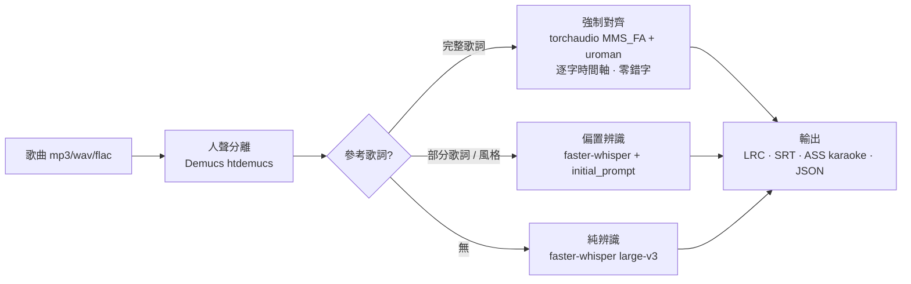
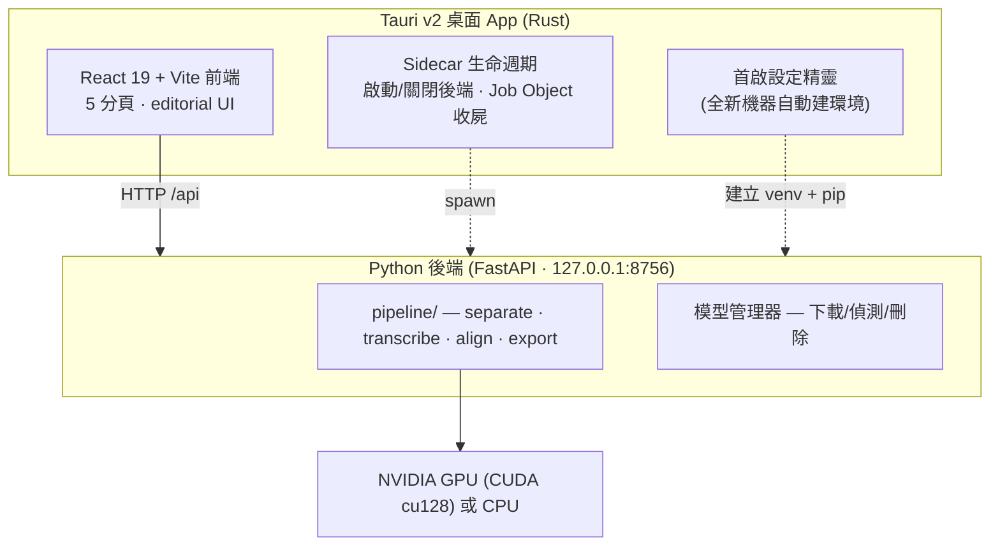

<div align="center">

# 🎵 AutoLyrics · LocalAiLyrics

**本地端 AI 歌詞辨識與對齊引擎 — Local-first AI singing-lyrics recognition & forced alignment**

把任何歌曲變成**字級時間軸**的歌詞(LRC / SRT / ASS-karaoke / JSON),全程在你自己的電腦上跑,**不上傳雲端**。

[](LICENSE)


</div>

---

## ✨ 為什麼選 AutoLyrics?

歌曲有伴奏、長拖音、和聲,直接丟 Whisper 常常錯字一堆、漏半首。AutoLyrics 用一條**多階段管線**把準確度拉滿,並把**「你已經知道的歌詞」**當成準確度的最大武器:

- 🎧 **本地優先**:Demucs + faster-whisper + torchaudio 全在本機 GPU/CPU 跑,歌曲與歌詞不外傳。
- 🎯 **參考歌詞 = 接近完美**:貼上完整歌詞 → **強制對齊**只算時間、零錯字;貼部分歌詞/風格 → **偏置辨識**。
- 🪄 **新創 editorial 介面**:歌詞文件會「自己播放」,正在唱的字金色掃過、低信心字琥珀標示。
- 🖥️ **真・桌面 App**:Tauri v2 打包成 `.exe` / `.msi`,自動啟動/關閉本機後端,還有**全新機器首啟設定精靈**。
- 🌏 **中 / 英 / 日 / 韓 / 多語**,中文逐字對齊(經 uroman 羅馬化)。
- 📤 **匯出** LRC(逐行/逐字)· SRT · **ASS 卡拉OK**(`\k` 掃光)· JSON。

---

## 🔬 辨識管線(這就是「為什麼比較準」)



| 階段 | 用的東西 | 作用 |
|---|---|---|
| ① 人聲分離 | **Demucs** `htdemucs` | 先把伴奏拿掉 — 單一最大準確度提升([研究實證](https://arxiv.org/html/2506.15514v1)) |
| ② 語音辨識 | **faster-whisper** `large-v3`(及 small…large-v3-turbo) | 開源最佳 ASR,字級時間軸 |
| ③ 參考歌詞 | 見上方三模式 | 你貼的歌詞/風格在這層被用上 |
| ④ 輸出 | LRC / SRT / ASS / JSON | 字級時間,可手動微調 |

> 實測:同一首歌、同 `small` 模型,**有沒有人聲分離**的差別是「前 56 秒 11 行」→「**全曲 268 秒 85 行**」。

---

## 🏗️ 架構



---

## 📦 下載 / Download

桌面安裝檔在 **[Releases](https://github.com/AriesHongHuanWu/LocalAiLyrics/releases)**(`AutoLyrics_x.y.z_x64-setup.exe` / `.msi`)。
安裝後第一次開啟,**首啟精靈**會引導你建立本機 Python 環境並下載一個辨識模型(需系統已裝 Python 3.10–3.12)。

> 💡 為什麼安裝檔很小卻要「進去再裝」?CUDA + 模型有 6GB+,無法塞進安裝檔 —— 所以採用業界標準:小安裝檔 + 首次啟動精靈下載引擎與模型。

---

## 🚀 從原始碼執行

### 系統需求
- Python **3.10–3.12**、Node **20+**、(建議)NVIDIA GPU。
- 本專案在 **RTX 5060 (8GB, Blackwell sm_120)** 上開發 → Blackwell 需 **PyTorch cu128**,安裝腳本已處理。
- 桌面打包另需 **Rust**(rustup)+ Windows 的 **MSVC「使用 C++ 的桌面開發」**。

### A) 純後端 + 內建測試 UI(最快驗證準確度)
```bash
cd backend
./install.ps1        # macOS / Linux: ./install.sh — 建 .venv、裝 cu128 PyTorch 與相依
./run.ps1            # 啟動 http://127.0.0.1:8756
```
開瀏覽器到 `http://127.0.0.1:8756`,拖入一首歌、(可選)貼參考歌詞、選風格 → 辨識。

### B) 桌面 App 開發模式
```bash
cd frontend
npm install
npm run tauri dev    # 自動起 Vite + 後端 sidecar,開桌面視窗
```

### C) 打包安裝檔
```bash
cd frontend
npm run tauri build  # → src-tauri/target/release/bundle/{nsis,msi}/
```

### CLI 端到端測試
```bash
backend/.venv/Scripts/python.exe -X utf8 backend/test_e2e.py "song.mp3" --model large-v3
backend/.venv/Scripts/python.exe -X utf8 backend/test_e2e.py "song.mp3" --lyrics lyrics.txt   # 強制對齊
```

---

## 🗂️ 介面(5 個明確分頁)

| 分頁 | 內容 |
|---|---|
| **辨識 Transcribe** | 單欄啟動台:拖檔 → 選模式(自動/偏置/強制對齊)→ 貼參考歌詞 → 風格 chips → 執行,3 階段進度 |
| **編輯 Editor** | 招牌:歌詞文件「自己播放」,正在唱的字 40px 暖金襯線 + `\k` 掃光、低信心字琥珀脈動、抓字拖曳重新對時(吸附人聲起音) |
| **匯出 Export** | LRC/SRT/ASS-karaoke/JSON 即時預覽,ASS 掃光隨播放動 = 所見即所存 |
| **紀錄 Library** | 過往辨識紀錄,可重開/重匯出 |
| **設定 Settings** | 引擎/裝置、GPU·VRAM、**模型管理器**(下載/刪除)、預設值 |

**設計語言**:「深色紙上的墨」暖石墨黑 `#121013` + 單一古典金 `#E8C36B` + 語意化三色(金=正在播 / 琥珀=低信心 / 綠=完成)+ Source Serif 4 × Noto Serif CJK(離線打包)。

---

## 🧰 技術棧

| 層 | 技術 |
|---|---|
| 人聲分離 | Demucs `htdemucs` |
| 語音辨識 | faster-whisper(CTranslate2)large-v3 / medium / small / large-v3-turbo |
| 強制對齊 | torchaudio `MMS_FA` + `forced_align`(免編譯器)+ uroman(CJK 羅馬化) |
| 後端 API | FastAPI + Uvicorn,執行緒任務佇列 |
| 前端 | React 19 · Vite 6 · TypeScript · Zustand · lucide-react |
| 桌面殼 | Tauri v2(Rust)+ Python sidecar + Windows Job Object |
| GPU | PyTorch **cu128**(NVIDIA Blackwell / sm_120) |

---

## 🗺️ 開發路線

- [x] **Phase 1** — Python 準確度引擎 + FastAPI + 內建測試 UI
- [x] **Phase 2** — React/Vite 旗艦前端(editorial 歌詞編輯器、字級重對時)
- [x] **Phase 3** — Tauri 桌面 App + Python sidecar(自動啟停 + Job Object 收屍)+ 安裝檔
- [x] **模型管理器** — App 內下載/偵測/刪除 + 首啟選模型
- [x] **全新機器首啟精靈** — 自動建 Python 環境 + 下載引擎
- [ ] 打包 **portable Python**(連 Python 都免裝)
- [ ] 進階引擎:HeartTranscriptor / SongTrans(音樂專用 SOTA)
- [ ] 粵語強化:FunASR / Paraformer

---

## 🤝 貢獻

歡迎 issue 與 PR!請見 [CONTRIBUTING.md](CONTRIBUTING.md)。

## 📄 授權

[MIT](LICENSE) © 2026 **Aries HongHuan Wu**

<div align="center">
<sub>Built with ❤️ for musicians, lyric-video makers, karaoke fans, and language learners.</sub>
</div>
